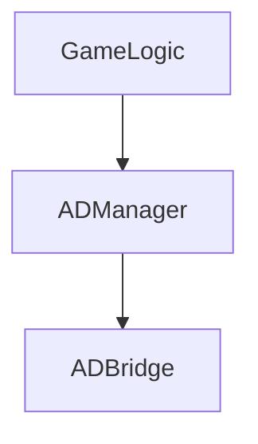

# 目的
我是做游戏开发的，我们的游戏主要使用广告进行变现。由于公司节奏快，项目多，需求变化快，所以需要写一个广告桥接设计，来将广告逻辑与游戏逻辑分离，减少游戏逻辑与广告sdk模块的耦合。
# 应用局限
此桥接设计适用于游戏内同时只接入一个广告平台（或者只有一个聚合平台）。若游戏需要同时接入多个广告平台，则此桥接无法胜任，需要进一步扩展。

文末demo工程已实现了桥接广告平台有：Mopub聚合，IronSource聚合，穿山甲，Mintegral。demo工程无法直接运行，若有需要请正常接入各广告平台，然后复制ADBridge目录下需要的代码进行测试。

# 设计原则
**设计模式六大原则**
+ 单一职责原则SRP(Single Responsibility Principle)
+ 开闭原则OCP(Open-Closed Principle)
+ 里氏替换原则LSP(Liskov Substitution Principle)
+ 依赖倒置原则DIP(Dependency Inversion Principle)
+ 接口隔离原则ISP(Interface Segregation Principle)
+ 迪米特法则LoD(Law of Demeter)

以六大原则为中心思想，针对接口编程，分离广告逻辑与游戏逻辑。降低耦合度，提高代码复用性。
当然此六大原则写在这里主要是提醒自己要保持谦虚，时刻注意编码规范、设计规范。
# 总体设计

- **ADBridge** 提供与广告平台桥接。负责处理广告的调用与广告回调的接收转发。
- **ADManager** 负责连接ADBridge与GameLogic，处理部分游戏内与广告有关内容，比如广告相关的统计事件。
- **GameLogic** 负责调用广告的播放，处理广告回调之后的游戏逻辑，比如激励视频广告播完发放奖励。
# 详细设计
## ADBridge
- AdUnit
```
    public enum AdType {
        Banner = 1,
        Interstitial = 2,
        Reward = 3,
        Feed = 4,
    }
    public struct AdUnit {
        public AdType adType;
        public string id;
    }
```
- IAdNotify
```
    public interface IAdNotify {
        void OnAdLoad();
        void OnAdLoadFailed();
        void OnAdShow();
        void OnAdClick();
        void OnAdClose();
    }
    public interface IRewardADNotify : IAdNotify {
        void OnAdReward();
    }
```
- IAdBridge
```
    public interface IAdBridge{
        void Request(AdUnit adUnit);
        void ShowAd(AdUnit adUnit);
        void ShowAd(AdUnit adUnit, IAdNotify adNotify);
        void CloseAd(AdUnit adUnit);
        void SetNotify(AdType adType, IAdNotify adNotify);
        void SetAlwayNotify(AdType adType, IAdNotify adNotify);
        bool IsAdReady(AdUnit adUnit);
    }
```
整体面向接口进行设计，用于处理广告调用与回调。
不同广告平台需要自行实现IAdBridge接口。部分广告平台的回调不在主线程，需要将回调转发到主线程，可以参考Demo工程中的Loom。
## ADManager
- ADNotify
```
public class ADNotify : IAdNotify {
    public event Action onAdClick;
    public event Action onAdClose;
    public event Action onAdLoad;
    public event Action onAdLoadFailed;
    public event Action onAdShow;

    public void OnAdClick() {
        onAdClick?.Invoke();
    }
    public virtual void OnAdClose() {
        onAdClose?.Invoke();
    }
    public void OnAdLoad(){
        onAdLoad?.Invoke();
    }
    public void OnAdLoadFailed() {
        onAdLoadFailed?.Invoke();
    }
    public void OnAdShow() {
        onAdShow?.Invoke();
    }
}
public class RewardADNotify : ADNotify, IRewardADNotify {
    public event Action onAdReward;
    public event Action onAdSkip;
    private bool _isRewarded = false;

    public void OnAdReward(){
        _isRewarded = true;
    }
    public override void OnAdClose() {
        if (_isRewarded)
        {
            onAdReward?.Invoke();
        }
        else
        {
            onAdSkip?.Invoke();
        }
        _isRewarded = false;
        base.OnAdClose();
    }
}
```
ADNotify实现接口IADNotify，使用委托的方式进行事件转发。
你完全可以自行实现IADNotify，写一个不一样的ADNotify。
- ADManager
```
public class ADManager {
    private static IAdBridge adBridge;
    public static void Init();
    public staitc bool IsAdReady(AdUnit adUnit);
    public static void ShowAd(AdUnit adUnit, IAdNotify notify = null);
    public static void CloseAd(AdUnit adUnit);
}
```
ADManger需要在内部实例化一个IAdBridge对象，负责转发游戏逻辑端的请求。并处理部分游戏内与广告有关内容，比如广告相关的统计事件。
## GameLogic
```
    public void ShowRwardAD() {
        RewardADNotify notify = new RewardADNotify();
        notify.onAdShow += ()=> {
            Debug.Log("视频广告播放");
        };
        notify.onAdClick += () => {
            Debug.Log("视频广告被点击");
        };
        notify.onAdReward += () => {
            Debug.Log("视频广告看完");
        };
        notify.onAdSkip += () => {
            Debug.Log("视频广告中途退出");
        };
        notify.onAdClose += () => {
            Debug.Log("视频广告关闭");
        };
        ADManager.ShowAD(GameAdID.Reward, notify);
    }
```
游戏逻辑这部分主要是游戏内具体场景播放广告，处理广告回调。
# 总结
开篇已说过此设计是为了服务“节奏快，项目多，需求变化快”这个工作节奏。

换游戏时就改ADManager这一层，需要切换广告平台时就改ADBridge这一层。GameLogic调用这一层始终不用改。提高了代码复用性，减少代码改动。

此套桥接设计我在不同游戏、不同广告平台中已多次使用，完全适用目前的开发需要。
当然根据实际情况，若项目有需要，此桥接设计还会继续更新。

[Demo](https://github.com/LingXin94/UnityAdBridge)
